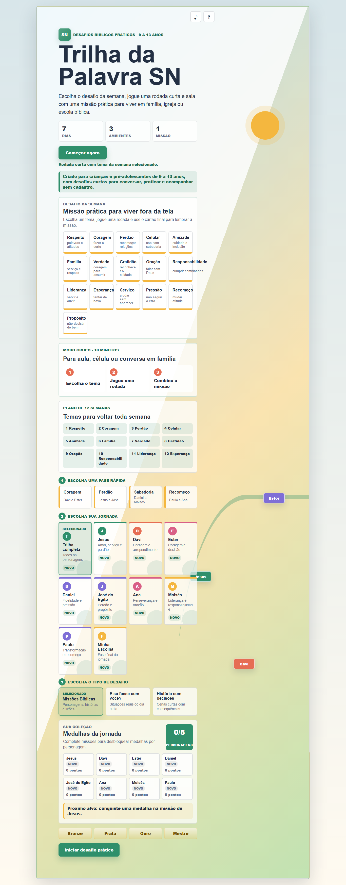
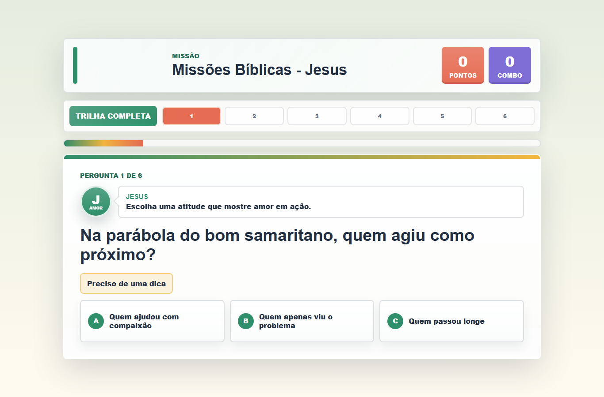
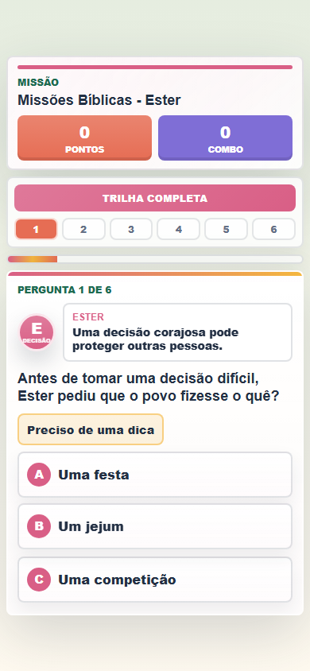

# Trilha da Palavra SN

Ferramenta de desafios biblicos praticos para criancas e pre-adolescentes de 9 a 13 anos, criada para familia, igreja e escola biblica. O projeto transforma historias e valores biblicos em missoes semanais para praticar fora da tela.


## Links Rapidos

- [Demo online](https://trilha-da-palavra-sn.netlify.app)
- [Documentacao profissional](docs/README.md)
- [PRD do produto](docs/PRD.md)
- [Relatorio tecnico](docs/RELATORIO_TECNICO.md)
- [Guia de deploy](docs/DEPLOY.md)
- [Operacao do cliente](docs/OPERACAO_CLIENTE.md)
- [Roteiro de apresentacao](docs/ROTEIRO_APRESENTACAO.md)
- [Proposta comercial](docs/PROPOSTA_COMERCIAL.md)
- [Checklist de implantacao](docs/CHECKLIST_IMPLANTACAO.md)
- [Termos minimos](docs/TERMOS_MINIMOS.md)
- [Politica de privacidade/LGPD](docs/POLITICA_PRIVACIDADE_LGPD.md)
- [Evolucao para producao robusta](docs/EVOLUCAO_PRODUCAO.md)

## Visao Geral

O projeto oferece uma experiencia segura, simples e educativa para conduzir conversas, desafios praticos e acompanhamento em casa, aula ou grupo, sem login, sem chat, sem anuncios, sem compras e sem coleta de dados pessoais.

Fluxo principal:

```text
tema da semana -> pergunta -> feedback -> missao pratica -> cartao compartilhavel
```

## Publico-alvo

- Principal: criancas e pre-adolescentes de 9 a 13 anos.
- Secundario: familias, professores, lideres e responsaveis que conduzem o desafio.
- Uso indicado: familia, igreja, escola biblica, pequenos grupos e atividades educativas.

## Preview

| Tela inicial | Pergunta no desktop | Pergunta no celular |
| --- | --- | --- |
|  |  |  |

## Demonstracao Visual

As telas demonstram o posicionamento do produto como ferramenta educativa pratica: escolha de desafio semanal, rodada curta, respostas proximas da pergunta no celular, feedback acolhedor, missao final e cartao para acompanhamento.

## Funcionalidades

- Mapa de missoes por personagem.
- Modos de jogo: missoes biblicas, situacoes do dia a dia e historias com decisoes.
- Perguntas de multipla escolha.
- Dicas com reducao de pontuacao.
- Feedback educativo depois de cada resposta.
- Missao pratica ao final de cada desafio.
- Pontuacao, combo, nivel e medalhas.
- Progresso salvo somente no navegador do usuario com `localStorage`.
- Interface responsiva para celular, tablet e desktop.
- Menu hamburguer no mobile.
- Botao de inicio rapido para celular e tablet.
- Tela de perguntas compacta no celular.
- Rolagem automatica para pergunta e proxima acao durante a rodada.
- Sons opcionais para acerto, erro, inicio e conclusao.
- Cartao de missao copiavel e exportavel em PNG.
- Plano de 12 semanas para uso recorrente.

## Como Rodar Localmente

Abra o arquivo `index.html` no navegador ou execute com um servidor local simples.

```bash
python -m http.server 8013
```

Depois acesse:

```text
http://localhost:8013
```

## Qualidade e Testes

Validacoes locais recomendadas:

```bash
node --check script.js
node --check data.js
```

O projeto tambem deve ser validado com teste manual no navegador, fluxo completo de jogo, responsividade em celular/tablet/desktop e revisao pedagogica/biblica antes de uso publico amplo.

## Rotas Principais

Este e um projeto estatico, sem API e sem servidor proprio. As rotas principais sao arquivos publicos:

- `GET /`
- `GET /index.html`
- `GET /styles.css`
- `GET /data.js`
- `GET /script.js`

## Privacidade

O projeto nao coleta nome, e-mail, telefone, imagem, localizacao ou qualquer dado pessoal. O progresso fica salvo apenas no navegador do usuario, por meio de `localStorage`, e pode ser apagado limpando os dados do navegador.

## Estrutura

```text
Trilha da Palavra SN/
|-- index.html
|-- styles.css
|-- data.js
|-- script.js
|-- netlify.toml
|-- README.md
`-- docs/
    |-- README.md
    |-- PRD.md
    |-- RELATORIO_TECNICO.md
    |-- DEPLOY.md
    |-- OPERACAO_CLIENTE.md
    |-- ROTEIRO_APRESENTACAO.md
    |-- PROPOSTA_COMERCIAL.md
    |-- CHECKLIST_IMPLANTACAO.md
    |-- TERMOS_MINIMOS.md
    |-- POLITICA_PRIVACIDADE_LGPD.md
    |-- EVOLUCAO_PRODUCAO.md
    `-- screenshots/
```

## Status do Projeto

Versao publicada no Netlify para validacao educativa e demonstracao online:

```text
https://trilha-da-palavra-sn.netlify.app
```

O projeto e estatico, sem API, sem banco remoto e sem coleta de dados pessoais. Antes de uso publico amplo, recomenda-se revisao biblica, revisao pedagogica e teste acompanhado com o publico-alvo.
